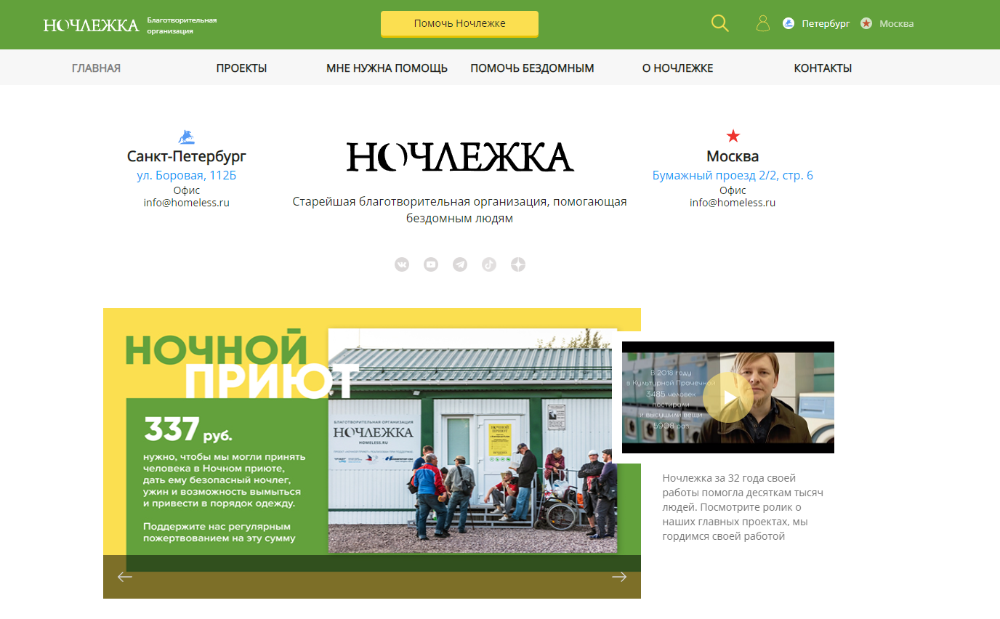

# UI автотесты для сайта проекта [Ночлежка](https://homeless.ru//)

## Автотесты написаны с использованием:

## Список проверок, реализованных в автотестах:

- [X] - Открытие главной страницы сайта
- [X] - Переход на страницу пожертвований
- [X] - Дефолтное состояние страницы пожертвований
- [X] - Проверка возможностей выбора различных форм и сумм пожертвований
- [X] - Проверка заполнения полей в форме для отправки пожертвований

## Пример видеозаписи прохождения теста:

  
## Скриншоты:
#### *Selenoid используется для реализации протокола Selenium.::*

 
 
#### *Jenkins используется в качестве CI системы*

  
 
#### *Allure Reports подключен для формирования отчетов о прохождении тестов:*

 
 
#### *Allure TestOps используется в качестве Тест Менеджмент системы:*

 
 
#### *Настроена интеграция Test Ops с Jira:*

  
 
#### *Настроено автоматическое оповещение о результатах запуска тестов в Jenkins в Telegram-чат с помощью бота:*

 
 

Благодарности :pray: 
:green_heart: <a target="_blank" href="https://qa.guru">qa.guru</a> 
:violet_heart: <a target="_blank" href="https://sites.google.com/view/qasisters/">QA sisters</a> 