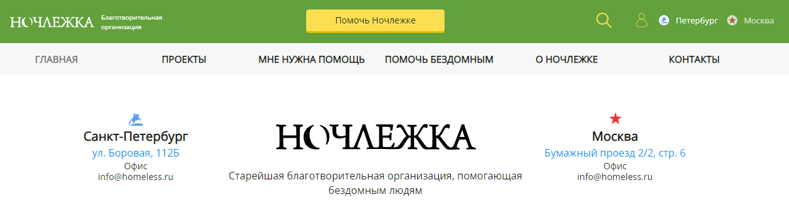
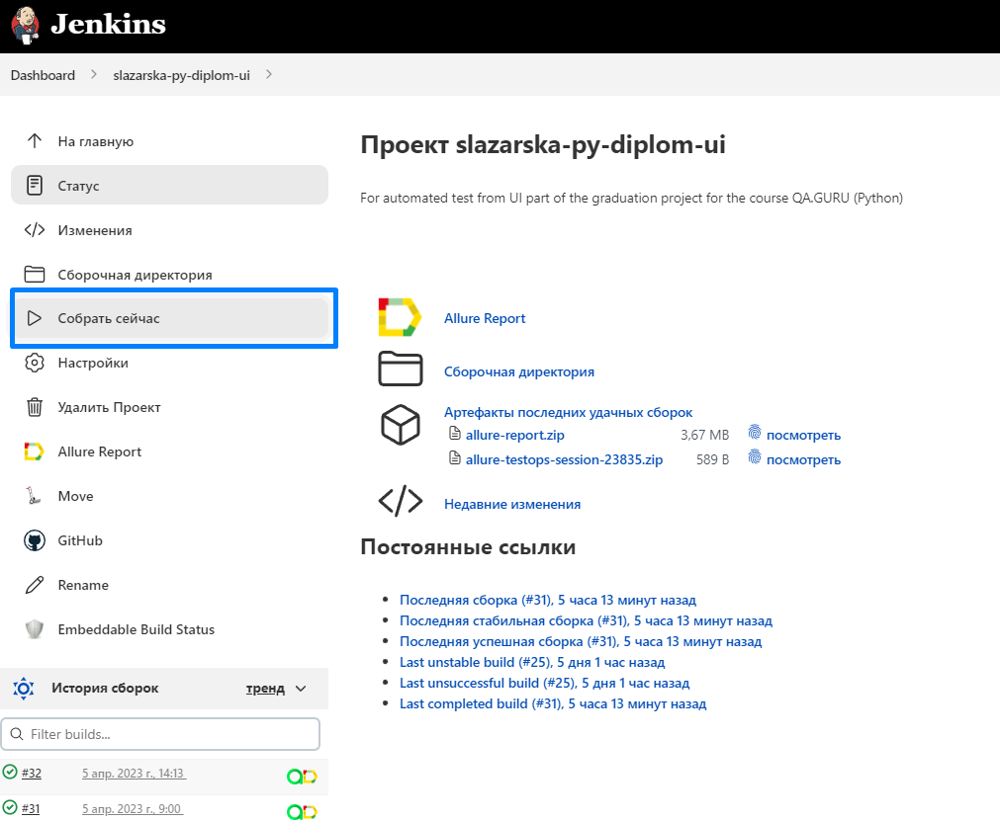
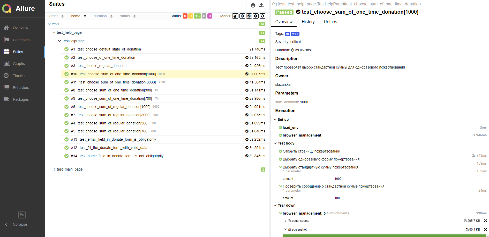
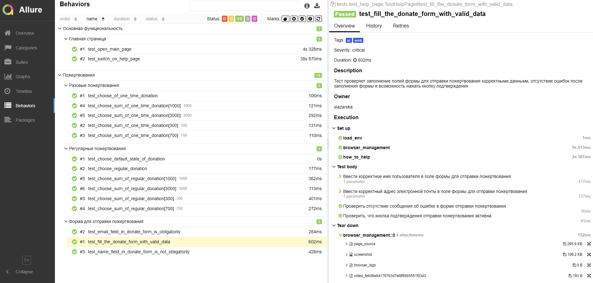
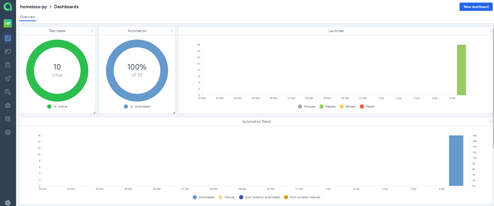
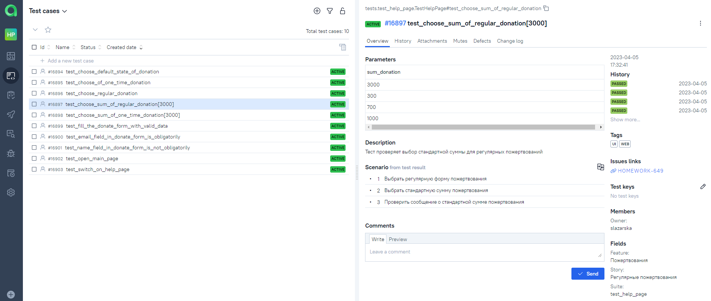
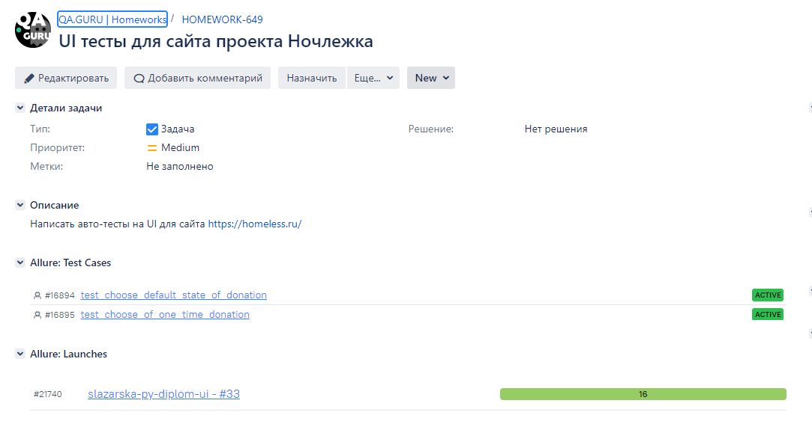
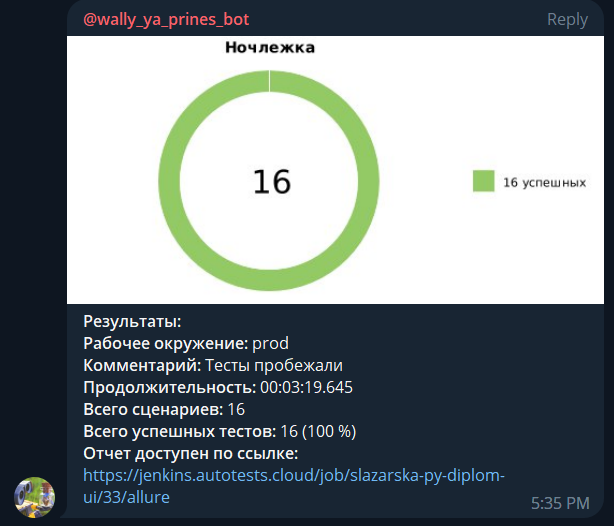
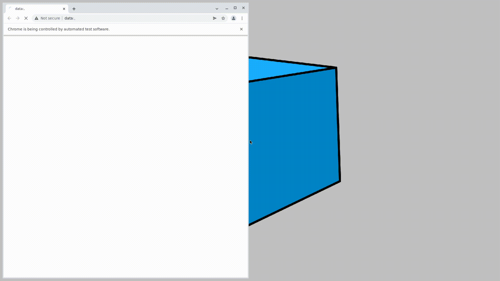

# UI автотесты для сайта проекта [Ночлежка](https://homeless.ru//)


## Содержание:
- [Technology Stack](#автотесты-написаны-с-использованием)
- [О проекте](#о-проекте)
- [Список проверок, реализованных в автотестах:](#список-проверок-реализованных-в-автотстах)
- Запуск тестов:
  - [Jenkins](#удаленный-запуск-через-jenkins)
  - [Локально](#запуск-тестов-локально)
- Интеграции и отчетность:
  - [Allure Report](#allure-report-подключен-для-формирования-отчетов-о-прохождении-тестов)
  - [Allure TestOps](#allure-testOps-используется-в-качестве-Тест-Менеджмент-системы)
  - [Jira](#настроена-интеграция-TestOps-с-Jira)
  - [Telegram](#настроено-автоматическое-оповещение-о-результатах-удаленного-запуска-тестов-в-Telegram-чат)
- [Video](#пример-записи-экрана-при-прохождения-теста)


## Автотесты написаны с использованием:
<div>


</div>

## О проекте:

- [x] Паттерны `Page Object` и `Application Manager`
- [x] Self-documenting code
- [x] Параметризация
- [x] Запуск тестов с использованием Jenkins и Selenoid
- [x] `Allure Reports` с приложением логов, скриншотов, записей экрана
- [x] Интеграция с `Allure TestOps`
- [x] Интеграция с `Jira`
- [x] Отправка результатов тестовых прогонов в `Telegram`

## Список проверок, реализованных в автотестах:

- [X] - Открытие главной страницы сайта
- [X] - Переход на страницу пожертвований с главной страницы
- [X] - Дефолтное состояние страницы пожертвований
- [X] - Проверка возможностей выбора различных форм и сумм пожертвований
- [X] - Проверка заполнения полей в форме для отправки пожертвований

## Удаленный запуск через [Jenkins](https://jenkins.autotests.cloud/job/Students/job/slazarska-py-diplom-ui/):

Для запуска тестов из Jenkins:
1. Нажмите кнопку "Собрать сейчас"



## Запуск тестов локально:

1. Склонируйте репозиторий
2. Установите Poetry (`poetry install`)
3. Откройте проект в PyCharm, установите Python Interpreter
4. Создайте .env файл в папке проекта по образцу (sample)
5. Запустите тесты в PyCharm или в командной строке:
```bash
pytest . --alluredir allure-results/
```

## Allure Report подключен для формирования отчетов о прохождении тестов:


<br />
<br />
> Для получения отчета в Allure Report при локальном запуске введите в командной строке:
```bash
allure serve .\allure-results
```

## Allure TestOps используется в качестве Тест Менеджмент системы:


<br />
<br />
## Настроена интеграция TestOps с Jira:

<br /> 
<br />
## Настроено автоматическое оповещение о результатах удаленного запуска тестов в Telegram-чат:

<br />
<br />
## Пример записи экрана при прохождения теста:

<br><br>

Благодарности :pray:<br/>
:green_heart: <a target="_blank" href="https://qa.guru">qa.guru</a><br/>
:purple_heart: <a target="_blank" href="https://sites.google.com/view/qasisters/">QA sisters</a><br/>